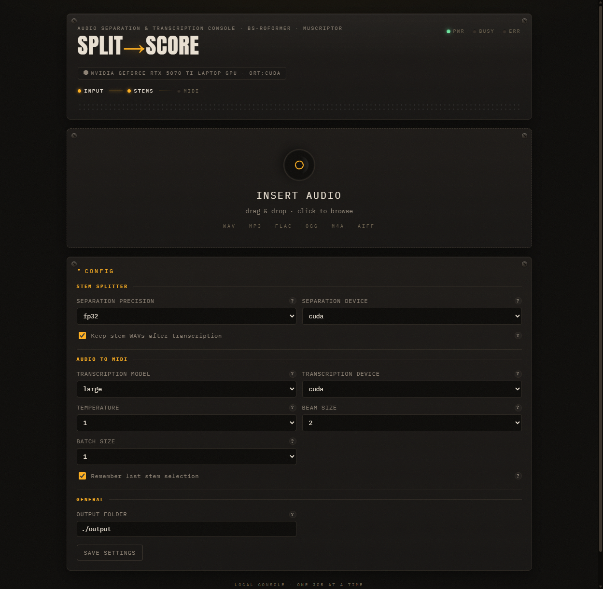

# SplitScore

    

Separate any audio file into 6 stems, then transcribe the ones you want to MIDI.
A local web console — no cloud, no accounts after initial model download.

```
audio ──▶ BS-RoFormer-SW ──▶ 6 stems ──▶ MuScriptor ──▶ per-stem .mid
```



## Table of Contents

- [Features](#features)
- [Installation](#installation)
- [Requirements](#requirements)
- [Usage](#usage)
- [GPU Support](#gpu-support)
- [Settings](#settings)
- [API](#api)
- [Project Structure](#project-structure)
- [Testing](#testing)
- [License](#license)

## Features

- 6-stem audio separation via BS-RoFormer-SW (ONNX inference)
- Per-stem MIDI transcription via MuScriptor (small / medium / large models)
- Local web console — drag-and-drop, progress bars, inline audio previews
- Auto-detects NVIDIA, AMD, Intel, and Apple Silicon GPUs
- One-command install via `uvx` — correct torch + ONNX backends installed automatically
- Configurable beam size, temperature, batch size, and model size
- REST API with SSE progress streaming

## Installation

### uvx (recommended)

```bash
uvx splitscore
```

Auto-detects your GPU, installs the correct torch variant and ONNX runtime,
and opens the app at `http://127.0.0.1:8000` (auto-falls back to a free port if 8000 is taken).
First run downloads models (~3 GB) to `~/.cache/`.

### pip

```bash
pip install splitscore
splitscore
```

### From source

```bash
git clone https://github.com/SeanDolan0/splitscore.git
cd splitscore
uv run python sync.py          # auto-detect GPU, install torch
uv run python -m app           # → http://127.0.0.1:8000 (auto-fallback if busy)
uv run python -m app --port 9000  # explicit port
```

### Hugging Face setup

MuScriptor weights are **gated** behind a CC BY-NC 4.0 (non-commercial) license.
You need a free Hugging Face account before transcription will work:

1. Accept the license at https://huggingface.co/muscriptor/muscriptor
2. Log in from the terminal:
   ```bash
   uv run hf auth login
   ```
   (or export `HF_TOKEN=hf_...` in your shell)

## Requirements

- **Python 3.13** and [uv](https://docs.astral.sh/uv/)
- **Windows 11** or **Linux**
- **NVIDIA GPU** recommended 
- **AMD GPU** (Linux, ROCm) works fully for both separation and transcription
- **Apple Silicon** — separation runs on CPU (ONNX has no Apple GPU provider), transcription uses MPS
- **Intel GPU** — falls back to CPU for both (no ONNX/ROCm provider available)

## Usage

1. **Drop** an audio file onto the console (wav, mp3, flac, ogg, m4a, aiff).
2. **Separation** runs automatically — watch the progress bar while 6 stems are extracted.
3. **Pick stems** — tick the checkboxes for vocals, piano, guitar, bass, drums, or other.
4. **Set instruments** — each stem gets an instrument dropdown; leave blank for auto-detect, or pick a specific instrument (piano, guitar, sax, synth, choir, etc.).
5. **Transcribe** — hit "TRANSCRIBE SELECTED TO MIDI" and download the `.mid` files.

### Stems

The separation model outputs 6 stems in a fixed order:

| Stem | Description |
|------|-------------|
| Bass | Electric/acoustic bass |
| Drums | Drum kit and percussion |
| Other | Everything not classified into the other 5 |
| Vocals | Singing, speech, voice |
| Guitar | Acoustic and electric guitar |
| Piano | Piano, keys, and keyboard |

Melodic stems (vocals, piano, guitar, bass) give the cleanest MIDI.
Drums and "other" tend to transcribe poorly.

## GPU Support

SplitScore auto-detects your hardware on startup:

| GPU | Torch variant | ONNX Runtime | Notes |
|-----|--------------|--------------|-------|
| NVIDIA | CUDA (auto-matched to driver) | onnxruntime-gpu | Best performance. No CUDA toolkit needed. |
| AMD | ROCm | onnxruntime-rocm | Linux only. |
| Intel | CPU | onnxruntime-directml | Windows only. |
| Apple Silicon | MPS | onnxruntime (CPU) | ONNX has no Apple GPU provider; separation runs on CPU. |
| None | CPU | onnxruntime | Works, just slower. |

The `sync.py` script handles all of this during dev setup.
The `splitscore` CLI handles it automatically for end users.

## Settings

All settings are adjustable in the web console's config panel and persist across runs.

<details>
<summary>Separation</summary>

| Setting | Default | Notes |
|---------|---------|-------|
| Device | auto | Compute device for ONNX inference. Auto-detects best GPU. |
| Precision | fp16 | fp16 (~336 MB model, faster, less VRAM) or fp32 (~669 MB). Switch to fp32 only if you hear artifacts. |

</details>

<details>
<summary>Transcription (MuScriptor)</summary>

| Setting | Default | Notes |
|---------|---------|-------|
| Model size | large | small (103M), medium (307M), large (1.4B). Small works on CPU. |
| Device | auto | Auto-detects best GPU. CUDA is significantly faster. |
| Temperature | 0.0 | 0 = deterministic. 0.5–1.0 adds natural variation but may introduce wrong notes. |
| Beam size | 4 | Higher = better sequences, more VRAM. 1 = greedy. |
| Batch size | 1 | 1 = best quality (enables prelude forcing). Higher = faster on long files but can cause chunk-boundary artifacts. |

</details>

<details>
<summary>General</summary>

| Setting | Default | Notes |
|---------|---------|-------|
| Output folder | ./output | Each job gets a subfolder with `stems/` and `midi/` subdirectories. |
| Keep stems | on | Keep separated WAV files after transcription. Turn off to save disk space. |
| Remember selection | on | Restore your last stem checkboxes across jobs via browser storage. |

</details>

## API

The app exposes a REST API consumed by the frontend:

| Method | Route | Description |
|--------|-------|-------------|
| POST | `/api/jobs` | Upload audio → returns `{job_id}`, starts separation |
| GET | `/api/jobs/{id}` | Job status, stem list, MIDI file list |
| POST | `/api/jobs/{id}/transcribe` | Start transcription: `{"stems": ["vocals","piano"]}` |
| POST | `/api/jobs/{id}/cancel` | Cancel a running job |
| GET | `/api/jobs/{id}/events` | SSE stream — real-time progress, stem/MIDI events |
| GET | `/api/settings` | Current settings |
| PUT | `/api/settings` | Update settings (partial merge, persists to disk) |
| GET | `/api/instruments` | MuScriptor instrument vocabulary |
| GET | `/api/hardware` | GPU info, torch/CUDA/ONNX versions |

## Project Structure

```
splitscore/
├── app/
│   ├── __init__.py        # version
│   ├── __main__.py        # python -m app
│   ├── cli.py             # uvx splitscore entry point
│   ├── gpu.py             # GPU detection + provider resolution
│   ├── main.py            # FastAPI routes, SSE, static mount
│   ├── pipeline.py        # Job orchestration, one-at-a-time lock
│   ├── separator.py       # BS-RoFormer-SW ONNX inference
│   ├── settings.py        # Settings dataclass, JSON persistence
│   ├── transcribe.py      # MuScriptor wrapper
│   └── static/            # Vanilla JS/CSS frontend (no build step)
├── tests/                 # pytest, ~2s, no GPU needed
├── sync.py                # Dev setup: detect GPU, install torch
├── pyproject.toml
└── LICENSE                # MIT
```

## Testing

```bash
uv run pytest                              # all tests
uv run pytest tests/test_pipeline.py       # single test file
```

Tests use fake separator/transcriber factories — no GPU, no Hugging Face token, no real models.
The full suite runs in ~2 seconds.

## License

- **Code:** MIT — see [LICENSE](LICENSE).
- **Models:** the separation model and MuScriptor weights are distributed under their own licenses.
  MuScriptor's weights are **CC BY-NC 4.0** (non-commercial) and gated on Hugging Face;
  that restriction applies to the models regardless of this project's MIT license.
